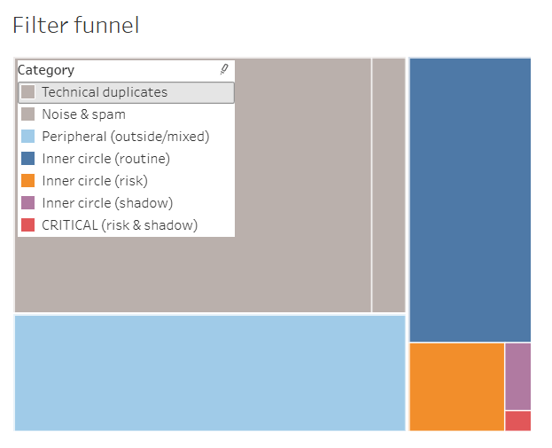
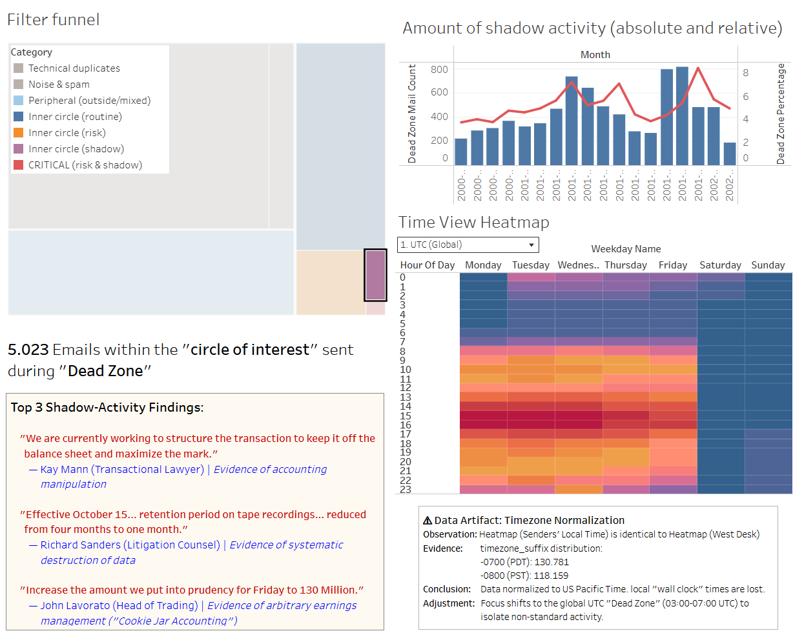
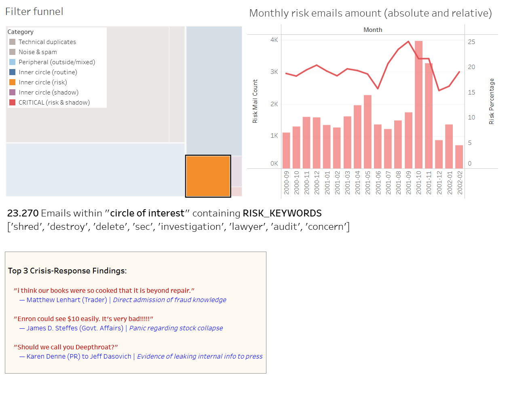
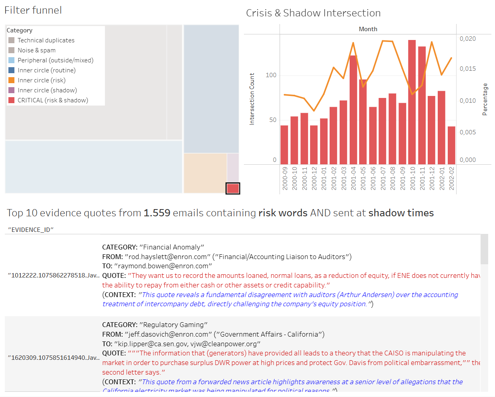

# 🕵️‍♂️ Digital Forensics Lab: Enron Email Dataset Analysis
### A Reproducible "Air-Gapped" Pipeline for Corporate Fraud Detection

<div align="center">


</div>

> **Context:** Portfolio Project for Google Data Analytics Professional Certificate
> **Status:** ✅ Completed (December 2025)

---

## 📋 Executive Summary

This project simulates a **digital forensic investigation** on the Enron Email Dataset (~500,000 emails). The goal was to build a scalable analysis pipeline to detect anomalies, behavioral patterns, and concrete **indicators of corporate fraud** within a massive, unstructured dataset.

**The Approach:**
A **local Docker Compose environment** was engineered for this task. This "Infrastructure as Code" approach ensures that the analysis is reproducible and simulates the data sovereignty constraints of a secure forensic lab.

**The Analytical Outcome:**
The project serves as a **Proof of Concept (PoC)** to generate targeted leads for investigators:
1.  **Behavioral Analysis:** Identification of suspicious activity outside standard business hours ("Shadow Timeline").
2.  **Content Analysis:** Screening for high-risk terminology (e.g., *shred, lawyer, audit*) - "Panic Timeline".
3.  **Lead Generation:** The pipeline successfully filters the dataset down to specific **clusters of interest** (e.g., the 'Critical Intersection' of shadow- and high-risk activity). From these clusters, **specially configured LLM agents** analyze the content to extract evidence and define concrete investigative avenues (new keywords, specific entities) for subsequent deep dives.

---

## 🏗️ Infrastructure & Architecture

The technical stack was chosen to ensure performance and isolation:

*   **Containerization (Docker):** The entire pipeline (Database + Analysis) runs in containers to ensure consistent execution.
*   **Storage (PostgreSQL):** Raw data is loaded into a relational database to enable complex SQL querying, which is superior to working with simple text files.
*   **Analysis (Python/Pandas):** Jupyter Notebooks handle the data loading, cleaning (removing duplicates), and complex calculations.
*   **AI-Augmentation (LLMs):** Integration of Large Language Models (Gemini 2.5 Pro) via **specially configured forensic agents**. These agents perform qualitative content analysis and entity extraction on isolated dossiers.
*   **Visualization (Tableau Public):** An interactive dashboard provides a **highly concentrated overview** of the analytical process and demonstrates the quality of the forensic results.

---

## ⚙️ Methodology: The "Forensic Funnel"

To process 500,000+ emails efficiently, a multi-stage reduction pipeline was developed using Python and SQL.

### 1. Data Engineering (Ingest & Standardization)
The raw dataset presented challenges due to inconsistent field formatting and mixed timestamp standards.
*   **Action:** A robust ingestion script was implemented to normalize all timestamps to **UTC** (Global Standard) while simultaneously calculating a **"Wall Clock" Time** to prepare for behavioral profiling.

### 2. Cleaning & Deduplication (Volume Reduction)
An exploratory analysis of top senders and subjects was conducted to understand the data landscape.
*   **Noise Filtering:** Based on these frequency lists, an LLM-assisted pattern matcher was developed to flag obvious system noise (e.g., "Outlook Migration") while strictly avoiding false negatives.
*   **Discovery:** A structural anomaly was found: The dataset contained massive redundancy due to its original file-system structure (one copy per recipient).
*   **Solution:** A strict **Semantic Deduplication** logic was applied based on the unique combination of *Sender + Timestamp + Recipients + Body*.
*   **Result:** This step reduced the dataset volume by **~50%** (from ~500k to ~250k).
*   **Graph Preparation:** To enable network analysis, two relational tables were created: `communication_links` and `communication_network`.

### 3. Network Analysis & Behavioral Pivot
*   **Initial Anomaly ("Ghost CEOs"):** An initial check revealed a suspiciously low number of sent emails from the C-Suite, suggesting either the use of gatekeepers or the destruction of evidence.
*   **Strategic Pivot:** Consequently, the focus shifted from analyzing the executives themselves to analyzing the **communication network around them**.
*   **Graph Construction:** The `communication_network` table was used to map the organizational topology and filter the dataset to the "Inner Circle" (the C-Suite and their first- and second-degree contacts).
*   **The "Timezone Trap":** A timezone distribution check revealed that the archive was normalized to US Pacific Time, rendering the calculated "Wall Clock" times unusable for behavioral analysis.
*   **Final Pivot:** The analysis focus shifted to the **Global "Dead Zone"** (03:00 AM – 07:00 AM UTC and weekends), the period of lowest global traffic, where any activity is statistically anomalous.

### 4. Behavioral & Content Analysis
Two primary analytical lenses were applied to the "Inner Circle" data.

*   **1. "Shadow Timeline" (Behavioral Analysis):** This analysis focused on activity within the "Dead Zone". It revealed two distinct peaks of absolute activity: one in **Spring 2001** and a second during the corporate collapse in **October/November 2001**.

*   **2. "Panic Signals" (Content Analysis):** This analysis scanned for high-risk keywords (`shred`, `destroy`, `sec`, `lawyer`, `audit`, `concern`). It showed that the *relative* percentage of "panic talk" began to rise as early as **July 2001**, months before the absolute peak in October/November.

*   **3. The "Critical Intersection" (A Discovery During Visualization):** The overlap between the "Shadow" and "Panic" clusters was defined during the construction of the treemap visualization. This **"Critical Intersection"** was revealed to be an extremely small, highly concentrated group. Its low volume enabled a unique analytical approach: a **consolidated analysis** where all dossiers were processed simultaneously by a specialized LLM agent. This unplanned step, born from a visualization requirement, provided a holistic, systemic view of the crisis, connecting the actions of individual actors into a unified narrative.

### 5. The "Tiered Filtering" Strategy
To balance context with precision, a dynamic filtering logic was applied:
*   **For Profiling:** A broader filter was used to create comprehensive dossiers for "Shadow" and "Crisis" actors, capturing their full behavioral context.
*   **For the "Critical Intersection":- A strict filter (max. 5 recipients) was then applied to this high-risk group to isolate direct, potentially conspiratorial communication.

---

## 🤖 AI-Augmented Analysis

Instead of a time-consuming manual review, **Large Language Models (LLMs)** were used as autonomous forensic agents.

*   **Agent Protocol & Configuration:** To ensure objective and reproducible results, a strict protocol was enforced through a combination of prompting and technical settings:
    1.  **System Prompt Directives:** The core of the protocol was a detailed system prompt containing two strict instructions:
        *   **"Tabula Rasa":** The agent was explicitly forbidden from using any prior knowledge of the Enron case. All conclusions had to be based *exclusively* on the provided text.
        *   **Structured Output & Evidence Citation:** The prompt forced the agent to structure its output into specific analytical sections and, critically, to **substantiate every finding with the `EVIDENCE ID`** of the source email. This ensures a complete audit trail from conclusion back to the original data.
    2.  **Technical Configuration:** These instructions were technically reinforced by the model's settings:
        *   A low temperature (`0.2`) was used to ensure factual, deterministic output.
        *   Web search was disabled to technically prevent access to external information.

*   **The Multi-Agent Workflow:**
    1.  **Dossier Generation:** The Python/SQL pipeline first generates text dossiers for the top actors identified in the "Shadow", "Crisis", and "Intersection" clusters.
    2.  **Individual Dossier Analysis (Profiling):** The comprehensive dossiers of the top 5 "Shadow" and top 5 "Crisis" actors were analyzed individually by an agent. This step was designed to build detailed operational profiles and generate new keywords for further investigation.
    3.  **Consolidated Synthesis (System Analysis):** The small, highly concentrated dossiers from the "Critical Intersection" cluster were analyzed *together* by a second, specialized agent. This provided a holistic, systemic view and identified cross-dossier patterns and a unified narrative.
    4.  **Evidence Extraction:** As a final **follow-up action** for each analysis, a specialized prompt was used to extract the most significant quotes and their forensic context into machine-readable CSV files.
	
*📄 [View All Prompts & Configuration](./prompts/00_llm_configuration.md)*

---

## 🔎 Key Findings: Anatomy of a Collapse

The analysis isolated three phases of systemic fraud, its cover-up, and the corrupting influence that enabled it.

### 1. The Mechanics of Fraud
*   **Balance Sheet Manipulation:** Legal counsel **Kay Mann** structured deals specifically to keep them "**off the balance sheet**" ([*Source: shadow_report_kay_mann.md*](./llm_reports/shadow_report_kay_mann.md)). Head of Trading **John Lavorato** manipulated earnings by shifting profits ("**show no income**") and creating hidden reserves ("**increase prudency**") ([*Source: shadow_report_john_lavorato.md*](./llm_reports/shadow_report_john_lavorato.md)).
*   **Evidence Destruction:** Senior management (**Lavorato, Haedicke**) ordered the destruction of trading tapes by shortening the retention period from four months to one. ([*Source: shadow_report_richard_sanders.md*](./llm_reports/shadow_report_richard_sanders.md)).

### 2. Cover-Up & Corrupting Influence
*   **Undermining the Judiciary:** Enron made annual donations to an organization (**LOEC**) that provided "economic education" to sitting judges, while simultaneously influencing the hiring practices of its outside counsel ([*Source: intersection_consolidated_report.md*](./llm_reports/intersection_consolidated_report.md), [*crisis_report_jeff_dasovich.md*](./llm_reports/crisis_report_jeff_dasovich.md)).
*   **Purchased Politics & Orchestrated Pressure:** The company used political donations transactionally ("**keep on giving**") ([*Source: shadow_report_jeff_dasovich.md*](./llm_reports/shadow_report_jeff_dasovich.md)) and successfully "**orchestrated**" political pressure to **reverse costly agency policies** ([*Source: shadow_report_steven_kean.md*](./llm_reports/shadow_report_steven_kean.md)).
*   **Internal Admissions & Conflicting Orders:** While traders like **Matthew Lenhart** privately admitted the books were irreparably "**cooked**" ([*Source: crisis_report_matthew_lenhart.md*](./llm_reports/crisis_report_matthew_lenhart.md)), leadership gave conflicting directives: a narrow, official order to preserve documents stood in direct contrast to informal commands to systematically delete sensitive emails ([*Source: intersection_consolidated_report.md*](./llm_reports/intersection_consolidated_report.md)).

### 3. Core Evidence: Manipulation, Coordination & Admission
*   **Strategic Market Manipulation:** Documents prove **strategic coordination**: Enron **withheld** better power deals from California to protect the overpriced contracts of its own major customers ([*Source: crisis_report_jeff_dasovich.md*](./llm_reports/crisis_report_jeff_dasovich.md)). Simultaneously, they received tips from a **FERC staffer** on loopholes in price controls ([*Source: shadow_report_steven_kean.md*](./llm_reports/shadow_report_steven_kean.md)).
*   **Intentional Obfuscation:** The common practice of moving sensitive conversations from email to phone ("**give me a call**") was a **recurring pattern across different departments**, demonstrating the clear intent to avoid a digital paper trail ([*Source: crisis_report_matthew_lenhart.md*](./llm_reports/crisis_report_matthew_lenhart.md), [*shadow_report_john_lavorato.md*](./llm_reports/shadow_report_john_lavorato.md), [*intersection_consolidated_report.md*](./llm_reports/intersection_consolidated_report.md)).
*   **The Capitulation:** The single-word reply "**maybe**" from Communications Chief **Mark Palmer** to the direct question "**Bankruptcy?**" — the admission of total defeat. ([*Source: intersection_consolidated_report.md*](./llm_reports/intersection_consolidated_report.md)).

---

    
## 📊 Visualizations: The Forensic Dashboard

The interactive [Tableau](https://public.tableau.com/app/profile/tim.e.7470/viz/shared/9DKPC3ZYH) dashboard serves as the **final presentation layer**, telling the story of the investigation and providing a highly concentrated overview of the findings.

### 1. The Control Panel: The Forensic Funnel Treemap
The dashboard's entry point visualizes the **massive reduction of data** from the initial ~500k emails. Each colored block represents a distinct category, with its size proportional to the volume of emails within it. The user can click on each block to filter the other dashboard components.


*   **Grey/Light Blue Blocks (Low Priority):** Represent technical duplicates, system noise, and peripheral communication that were filtered out from the core analysis.
*   **Orange/Purple/Red Blocks (High Priority):** Represent the three core investigative clusters: **Risk**, **Shadow**, and the **Critical Intersection**.

### 2. Deep Dive: Shadow Mechanics
*Focus: Off-Hour Activity (Execution)*
This view uncovers the **mechanics of the fraud** by focusing on activity within the "Dead Zone": manipulating reserves ("prudency") and structuring off-balance-sheet deals during off-hours.


### 3. Deep Dive: Crisis Response
*Focus: Panic Signals (Reaction)*
This view tracks the internal collapse, highlighting the psychological shift from denial to panic and culminating in explicit admissions like "books were cooked".


### 4. The Critical Intersection (The "Smoking Guns")
*Filter: Risk Keywords + Dead Zone + Inner Circle*
This view isolates the highest-probability evidence, confirming the initial suspicion of fraud with high precision.


---

## 📄 Data Source

This project utilizes the **Enron Email Dataset**, which was originally collected and prepared by the CALO Project (A Cognitive Assistant that Learns and Organizes) at SRI International.

*   **Original Source:** Carnegie Mellon University
*   **Version Used:** A parsed CSV version of the dataset, containing approximately 500,000 emails, was obtained from Kaggle.
*   **Link:** [Kaggle: The Enron Email Dataset Parsed](https://www.kaggle.com/datasets/acsariyildiz/the-enron-email-dataset-parsed)

The `enron_mails.csv` file is not included in this repository due to its size (~1.3 GB).

---

## 📂 Repository Structure

The project is organized into functional directories to separate code, configuration, and results.

*   `docker-compose.yml`: Defines and configures the multi-container application (Postgres, Jupyter).
*   `db_init/`: Contains the `schema.sql` to initialize the database structure on first launch.
*   `data/`: The designated folder for the raw `enron_mails.csv` dataset (not included in this repo).
*   `notebooks/`: Contains the three core Jupyter notebooks that form the analysis pipeline.
    *   `analysis_results/`: A sub-directory containing all **machine-generated outputs** from the notebooks, including the text dossiers for the LLM, data exports, and plots.
*   `prompts/`: Contains the configuration and system prompts for the LLM agents.
*   `llm_reports/`: Contains the **manually curated final reports and quote lists** generated during the AI-augmented analysis phase.
*   `dashboard_visuals/`: Contains the final screenshots of the Tableau dashboard used in this README.

---

## 🛠️ Setup & Usage

To run this analysis pipeline locally, follow these steps.

### Prerequisites
*   [Docker](https://www.docker.com/products/docker-desktop/) and Docker Compose must be installed.
*   Git for cloning the repository.

### Setup Instructions

1.  **Clone the Repository:**
    ```bash
    git clone https://github.com/tim-e-0110/project-data_analytics_Enron_Email_Dataset.git
    project-data_analytics_Enron_Email_Dataset
    ```

2.  **Download the Dataset (IMPORTANT):**
    This repository does not include the ~1.3 GB Enron dataset.
    *   Download the `enron_mails.csv` file from a source like Kaggle: [Link to The Enron Email Dataset Parsed](https://www.kaggle.com/datasets/acsariyildiz/the-enron-email-dataset-parsed)
    *   Place the downloaded file into the `data/` folder.

3.  **Configure Environment Variables:**
    Copy the template file `.env.example` to `.env` and then edit the new `.env` file to set your own secure `POSTGRES_PASSWORD` and `JUPYTER_TOKEN`.
    ```bash
    cp .env.example .env
    ```

4.  **Start the Application:**
    Start the Docker containers. The first launch may take several minutes to build the images.
    ```bash
    docker compose up -d --build
    ```
    Jupyter Lab will then be available at `http://localhost:8888`.


---

## 🚀 Future Work & Scalability Roadmap

While this project operates as a "Proof of Concept", a production-grade deployment would imply the following upgrades:

1.  **Big Data Scaling:** Migration of the data processing pipeline to **Apache Spark** to handle terabytes of seized data.
2.  **API-driven Qualitative Analysis:** Integration of an LLM via its API directly into the Jupyter notebooks. This would replace the manual web UI workflow, enabling the automated, batch-processing of hundreds of dossiers. This approach also provides the flexibility to switch between commercial APIs and **locally hosted models** to maintain a fully air-gapped environment.
3.  **Advanced NLP / RAG:** Implementation of a Vector Database (e.g., pgvector) to enable semantic search (*"Show me conversations about destroying evidence"*) rather than keyword matching.

---

### 📬 Contact

**Project Author:** Tim Ermantraut

[](https://www.linkedin.com/in/tim-ermantraut-0b3a08149)
